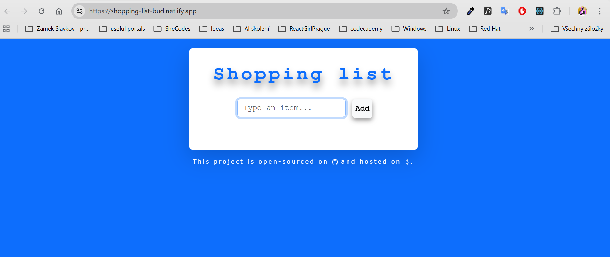

## 🛒 Shopping List App
*Simple and intuitive shopping list application built with React and TypeScript.*
*It allows users to manage their items efficiently with a clean and user-friendly interface.* 



👉[Live Demo] https://shopping-list-bud.netlify.app/  

**✨ Features**

```➕ Add new items ```
```✏️ Edit existing items```
```🗑️ Delete items```
```✅ Mark items as completed```
```⚠️ Input validation (prevents empty values)```
```💾 Persistent data using localStorage```
```🔔 User alerts ```

**🛠️ Tech Stack**
- React
- TypeScript
- useReducer (state management)
- Bootstrap (styling)
- Netlify (deployment)

**📦 Installation**
1. git clone https://github.com/KaterinaSlezakova/shopping-list.git
2. cd shopping-list
3. npm install
4. npm start

**🏗️ Build**
npm run build

**🧠 What I learned**
- Working with TypeScript types in a React project
- Managing state with useReducer
- Handling form validation and user input
- Using localStorage for data persistence
- Debugging and fixing TypeScript build errors
- Deploying a React app using Netlify

**🔧 Future Improvements**
- Filtering items (completed / active)
- Animations for adding/removing items
- Improved UI/UX
- Unit testing (Jest / React Testing Library)